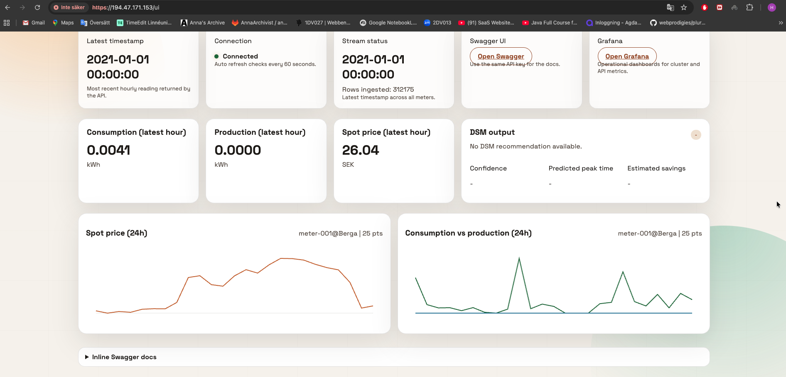
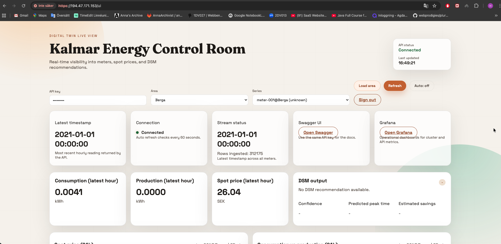

# Digital Twin - Smart Energy Platform

This repository hosts the full Digital Twin system for smart-energy simulation, processing, and visualization. It is designed to simulate meter readings, process them into DSM recommendations, persist time-series state, and expose data through a secure REST API with a custom UI.

## Start Pages

These screenshots show the start URL pages for the platform UI and API entry points.

## High-Level Architecture

Data flows left-to-right through the system:

1. **Data Generator** streams hourly meter readings to Kafka.
2. **Algorithm Processor** consumes readings, maintains Redis history, generates DSM decisions, and writes to TimescaleDB.
3. **TimescaleDB** stores the persistent time-series state and decisions.
4. **REST API** exposes query endpoints and serves the UI.
5. **UI + Swagger** provide human-facing access; Grafana provides ops dashboards.

## Microservices

- `data-generator/`
  - Reads CSV dataset and publishes meter readings to Kafka.
  - Optionally warms Redis with historical points for faster forecasting.
- `algorithm-processor/`
  - Consumes Kafka stream, maintains Redis history, calculates DSM decisions, and stores results in TimescaleDB.
- `rest-api/`
  - Exposes the Digital Twin state + history + decision endpoints.
  - Provides Swagger docs and the custom UI.
- `infrastructure-k8s/`
  - Kubernetes manifests for Kafka, Redis, TimescaleDB, services, and deployments.
- `visualization/`
  - Prometheus + Grafana deployment for ops visibility.

## Storage + Messaging

- **Kafka**: event bus for meter readings.
- **Redis**: history cache for algorithm processing.
- **TimescaleDB**: authoritative time-series state and decisions.

## Deployment (Production)

We deploy to a k3s cluster running on OpenStack Cumulus. Typical flow for shipping changes:

1. Build and push a Linux/amd64 image to Docker Hub.
2. Update image digest in `infrastructure-k8s` manifests.
3. Apply manifests on the VM (or via GitLab CD).
4. Verify rollouts and endpoint health.

## Key Endpoints

- REST API base: `https://<floating-ip>/`
- Swagger: `/docs`
- UI: `/ui`
- OpenAPI JSON: `/openapi.json`
- Health: `/health`

## Repos and Paths

- Root: `/Users/Hao/Desktop/Digital Twin/`
- Data Generator: `/Users/Hao/Desktop/Digital Twin/data-generator/`
- Algorithm Processor: `/Users/Hao/Desktop/Digital Twin/algorithm-processor/`
- REST API: `/Users/Hao/Desktop/Digital Twin/rest-api/`
- Infra: `/Users/Hao/Desktop/Digital Twin/infrastructure-k8s/`
- Visualization: `/Users/Hao/Desktop/Digital Twin/visualization/`

## Notes

- The dataset is trimmed to a 1-year window in the generator.
- Algorithm processor needs a sliding history window to produce DSM decisions.
- The UI requires the API key or a valid UI JWT session.

